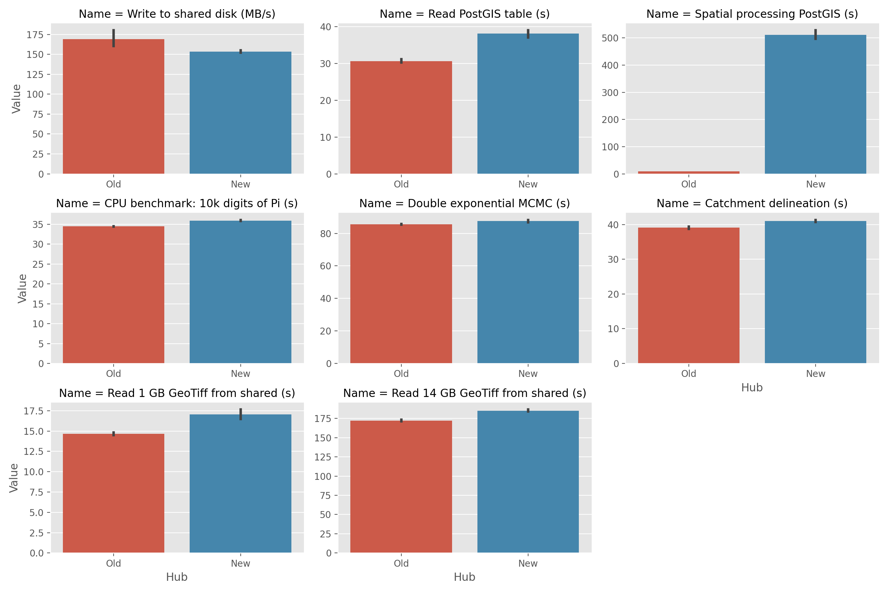

# JupyterHub benchmarking

Simple performance tests comparing the new JupyterHub to the old one.

## Limitations

Strict performance benchmarking is difficult because modern systems use lots of clever optimisations and caching. These tests do not attempt to account for this - I have simply compiled some illustrative JupyterHub (Python) workflows and timed them on both Hubs. Since the background architecture is essentially the same in both cases, I expect these test results to be fairly representative of overall performance.

Note the following caveats:

 * Tests on the old Hub using a `standard` machine were performed at times when other users were logged in and potentially using resources (e.g. accessing data on `shared` or querying from PostGIS). This may bias timings compared to the new Hub, where no other users were active during the tests.
 
 * The new hub is running a slightly older version of the `singleuser` image. Some package versions in the user environment may therefore be different. Both Hub images have been created within the past few months, however, so I do not expect the differences to be significant.

## Test summary

All tests are performed **10 times** on each Hub. In some cases a warm-up run is also performed (e.g. to compile Cython code in NivaPy before the main benchmarking starts). All tests use the `standard` machine, except `Test 2b`, which needs more memory.

### Test 1: Write speed to `shared` (MB/s; higher is better)

Based on the overview [here](https://romanrm.net/dd-benchmark).

The old Hub uses a do-it-yourself NFS server whereas the new one uses Google's Filestore. This test writes 1024 1-MB blocks of zeros (i.e. about 1 GB in total) to the shared drive and reports the average write speed in MB/s. The following command is run from the terminal in the top-level of the `shared` directory on each Hub

    dd bs=1M count=1024 if=/dev/zero of=test conv=fdatasync
    
### Test 2: Read time from `shared` (seconds; lower is better; [code](./notebooks/read_raster.ipynb))

This test times how long it takes to read and decompress an LZW-compressed GeoTiff from the `shared` drive into a numpy array. Two datasets are considered:

 * **Test 2a:** On the `standard` machine, read `norway_kartverket_40m_dtm_utm_z33.tif`, which is about 1 GB compressed and inflates to 4.5 GB in memory
 
 * **Test 2b:** On the `El Gordo` machine, read `norway_kartverket_10m_dtm_utm_z33.tif`, which is about 14 GB compressed and inflates to 73 GB in memory
 
### Test 3: Read time from PostGIS (seconds; lower is better; [code](./notebooks/test_postgis.ipynb))

This test times how long it takes to read an entire geospatial table from PostGIS. The test dataset is `norway_nibio_corine_2018_poly`, a national land cover map.

### Test 4: Spatial analysis in PostGIS (seconds; lower is better; [code](./notebooks/test_postgis.ipynb))

This test times how long it takes to perform a geospatial intersection between two polygon datasets in PostGIS. **This operation takes place within the database itself and therefore reflects the processing power of the PostGIS instance, not than the user's server**. The test clips the Corine land cover data to the bounding box of Aust-Agder.

### Test 5: Calculate the first 10k digits of Pi (seconds; lower is better; [code](https://github.com/alexdedyura/cpu-benchmark/blob/main/cpu-benchmark.py))

Use the code from [here](https://github.com/alexdedyura/cpu-benchmark) to time how long it takes to calculate the first 10k digits of Pi. Believed to be a reasonably good indicator of CPU performance.

### Test 6: Double-exponential MCMC (seconds; lower is better; [code](./notebooks/double_exp_mcmc.ipynb))

Estimate parameters for a double-exponential function based on a synthetic dataset with added random noise. Uses Markov chain Monte Carlo (MCMC) sampling to draw from the posterior distribution of the parameters given the data and explore parameter uncertainty. Based on my old tutorial on non-linear curve fitting [here](https://github.com/NIVANorge/niva_datasci_toolkit/blob/master/dstoolkit_examples/tutorials/07_NonLinear_Optimisation_and_Curve_Fitting.ipynb).

### Test 7: Catchment delineation (seconds; lower is better; [code](./notebooks/catchment_delineation.ipynb))

Use `nivapy.spatial.derive_watershed_boundaries` and a 40 m DTM to derive catchment boundaries for 21 water sampling locations in Finnmark (associated with the Quantom project).

## Results

Results from each test are shown on the bar charts below. Black vertical lines on each bar represent the variability over the 10 tests (as 95% confidence intervals). **For all tests except the first (`Write to shared disk`), lower scores are better**.

**The old Hub has better performance than the new Hub on all tests**. 

In most cases, differences are small and probably negligible. An exception is performance of the PostGIS database on the new cluster (top-right plot below), which is more than 50 times slower than the PostGIS instance on the old Hub. **The PostGIS database on the new Hub should have its resources increased**, because at present it is so slow that it is not usable for most common JupyterHub workflows.

Note that, at present, it is not possible to run Test 2b on the new Hub as the `El Gordo` machine is not available.

